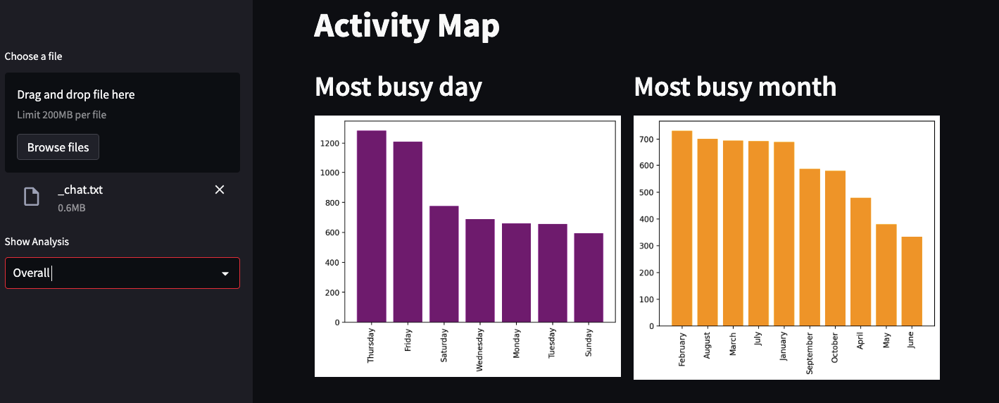

# WhatsApp Chat Analysis using Python and Streamlit


Conduct an in-depth analysis of WhatsApp group chat data, providing insights into user activity, engagement patterns, and overall group dynamics.

## Table of Contents

- [Overview](#overview)
- [Installation](#installation)
- [Usage](#usage)
- [Features](#features)
- [Contributing](#contributing)
- [License](#license)

## Overview

This project utilizes advanced statistical and data science techniques to analyze WhatsApp group chat data. It offers valuable insights into the total message count, word usage, file sharing, and link sharing. Additionally, the project provides monthly and weekly activity graphs to identify periods of heightened group engagement.





## Installation

1. Clone the repository from GitHub:

   ```bash
   git clone https://github.com/mddmustainbillah/chat_analysis_whatsapp_streamlit.git
    ```
2. Navigate to the project directory:
    ```bash
    cd chat_analysis_whatsapp_streamlit
    ```

3. Install the necessary Python dependencies using pip:
    ```bash
    pip install -r requirements.txt
    ```

## Usage

1. Ensure you have the necessary data available for analysis.
2. Run the Streamlit application using the following command:

    ```bash
    streamlit run app.py
    ```


3. Open the provided URL in your web browser to access the interactive visualizations and explore the chat analysis.

## Features
* Analysis of total messages, words, files, and links shared in the group.
* Individual user-specific analysis for a comprehensive understanding.
* Monthly and weekly activity graphs to identify peak engagement periods.
* User ranking based on activity levels.


## Contributing

Contributions are always welcome! If you have any suggestions, enhancements, or issues, please feel free to open an issue or create a pull request.

## License

This project is licensed under the [MIT License](https://opensource.org/licenses/MIT) - see the [LICENSE](LICENSE) file for details.
